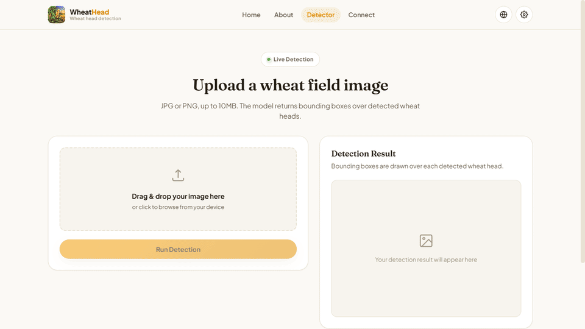
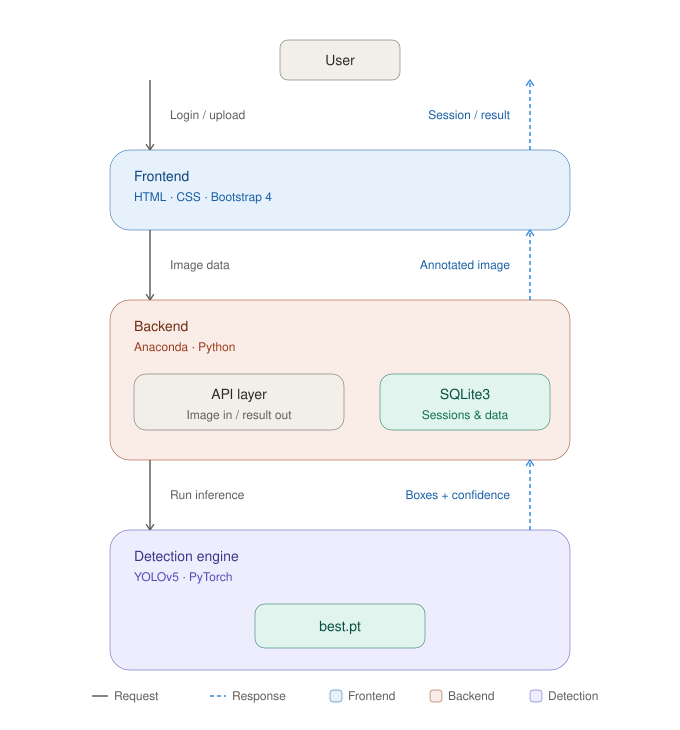

# WheatHead

Wheat head detection from field imagery, powered by a YOLOv5-based object detection model and served through a Flask web application.

[](https://www.python.org/)
[](https://flask.palletsprojects.com/)
[](https://pytorch.org/)
[](https://github.com/ultralytics/yolov5)
[](LICENSE)

---

## Overview

WheatHead detects and localizes wheat heads in images using a trained YOLOv5 model. Upload an image through the web interface and the app returns bounding boxes, confidence scores, and counts for every wheat head detected — useful for crop monitoring, yield estimation research, and agricultural image analysis.

The repository includes the full stack: model inference, training code and dataset configuration, the Flask backend, and the web frontend.

## Screenshots

| **Home** |
|---|
|  |

| **Detection** |
|---|
|  |

## Features

- **Wheat head detection** — bounding boxes, class labels, and confidence scores per detection
- **Web interface** — upload an image and view results without touching the command line
- **Trained checkpoint included** (`best.pt`) — ready for inference out of the box
- **Training pipeline** — retrain or fine-tune on your own dataset via `train.py`

## Architecture

<p align="center">
  
</p>

Solid arrows show the request path; dashed arrows show the response path — every tier is a round trip. Adapts automatically to light and dark mode.

| Step | Request → | ← Response |
|---|---|---|
| User ↔ Frontend | Login / upload | Session / result |
| Frontend ↔ Backend | Image data | Annotated image |
| Backend ↔ Detection engine | Run inference | Boxes + confidence |

## Sample Output

```
xmin      ymin      xmax      ymax      confidence   class   name
907.59    6.77      987.07    159.44    0.83         0       wheat
377.74    417.43    463.08    593.04    0.82         0       wheat
23.74     758.13    89.94     880.44    0.79         0       wheat
```

## Tech Stack

| Layer | Technology |
|---|---|
| Model | YOLOv5, PyTorch |
| Backend | Flask, Python 3.10 |
| Image processing | OpenCV, Pillow, NumPy |
| Data handling | Pandas, SciPy |
| Frontend | HTML, CSS, JavaScript |

## Project Structure

```
wheathead/
├── app.py                # Flask application entry point
├── train.py               # Training entry point
├── best.pt                 # Trained model checkpoint
├── configs/
│   ├── wheat.yaml
│   └── yolo-cbam.yaml
├── yolov7/                 # Dataset (train/valid/test splits)
│   ├── train/{images,labels}
│   ├── valid/{images,labels}
│   └── test/{images,labels}
├── static/                 # Frontend assets
├── templates/               # HTML templates
└── requirements.txt
```

## Getting Started

### Prerequisites

- Python 3.10
- pip

### Installation

```bash
git clone https://github.com/<your-username>/wheatvision.git
cd wheatvision

python -m venv .venv
source .venv/Scripts/activate      # Windows (Git Bash)
# .venv\Scripts\activate           # Windows (cmd)

pip install --upgrade pip
pip install -r requirements.txt
```

### Run the app

```bash
python app.py
```

Open the local address printed in the terminal to access the web interface.

### Verify the model loads correctly

```bash
python -c "import torch; model = torch.hub.load('ultralytics/yolov5', 'custom', path='best.pt', force_reload=False); print(model)"
```

### Run a quick inference test

```bash
python -c "
import torch
from PIL import Image
model = torch.hub.load('ultralytics/yolov5', 'custom', path='best.pt', force_reload=False)
img = Image.open('dataset/image/sample.jpg')
results = model(img)
print(results.pandas().xyxy[0])
"
```

## Training

To retrain or fine-tune on your own dataset:

```bash
python train.py
```

Before training, confirm:
- Dataset paths and train/valid/test splits under `yolov7/`
- Class definitions in `configs/wheat.yaml`
- Label files match image files
- Available hardware (CPU vs GPU)

> Training commands should be adapted to your exact configuration rather than copied blindly from a different YOLO version.

## Hardware Notes

The reference model has **~140M parameters** and **~208 GFLOPs**. Inference runs on CPU but is significantly faster on GPU — for large batches or real-time use, GPU acceleration is recommended.

## Roadmap

- [ ] GPU acceleration and model quantization
- [ ] Batch and video/real-time inference
- [ ] Wheat-head counting and yield estimation utilities
- [ ] REST API endpoint
- [ ] Docker and cloud deployment

## Contributing

Contributions are welcome.

```bash
git checkout -b feature/your-feature
git commit -m "Add your feature"
git push origin feature/your-feature
```

Then open a pull request.

## License

Licensed under the [Apache License 2.0](LICENSE). Third-party components (YOLOv5, PyTorch, etc.) remain subject to their respective licenses.
